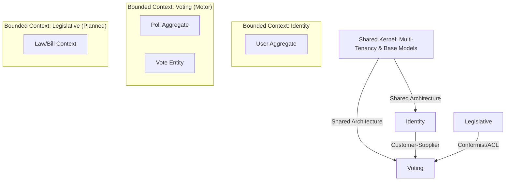

# DDD — Camada Estratégica

Este documento formaliza o design estratégico do sistema, garantindo o alinhamento entre o negócio e a implementação técnica de um motor de votação multi-tenant.

## 1. Visão Geral do Domínio

O sistema é um **Motor de Votação (Voting Engine)** agnóstico e de alta performance, desenhado para ser o alicerce de plataformas de governança digital. 

O diferencial core é a flexibilidade: o sistema não conhece as regras específicas de quem está votando (ex: Câmara Municipal vs. Condomínio), mas fornece as garantias fundamentais de **integridade, isolamento e auditabilidade** através de uma arquitetura **Multi-Tenant**.

### Objetivos Estratégicos
- **Isolamento de Dados**: Garantir que cada inquilino (Tenant) tenha sua própria jurisdição lógica.
- **Escalabilidade Horizontal**: Suportar o uso como SaaS (Software as a Service) ou instâncias isoladas (On-premise).
- **Agnosticismo**: Separar o "como votar" (Voting Context) de "o que está sendo decidido" (Legislative Context).

## 2. Mapa de Contextos (Context Map)

O sistema utiliza um **Shared Kernel** para garantir a consistência da identidade do inquilino em todos os contextos.

### Relação entre Contextos
- **Shared Kernel**: Provê `TenantId`, `AggregateRoot` e `UniqueEntityId`. Essencial para o isolamento.
- **Identity -> Voting**: O contexto de Voting consome a identidade verificada do eleitor.
- **Legislative -> Voting**: O contexto legislativo (em planejamento) usará o motor de votação para decidir o destino de Projetos de Lei.

## 3. Modelo de Tenancy e Isolamento

O sistema adota o modelo de **Isolamento Lógico (Shared Database)**.

- **Identidade Única**: Toda `AggregateRoot` possui um `TenantId`.
- **Filtro Obrigatório**: Repositórios e Handlers não podem realizar operações sem um `TenantId` válido.
- **Resolução de Contexto**: O inquilino é resolvido na camada de Aplicação via `ITenantProvider`.

## 4. Linguagem Ubíqua (Glossário)

| Termo (PT-BR) | Termo (Código) | Definição |
| :--- | :--- | :--- |
| **Inquilino** | `Tenant` | Uma organização isolada (ex: Câmara, Conselho, Associação). |
| **Pauta / Sessão** | `Poll` | O objeto central que define o que está sendo votado. |
| **Opção de Voto** | `PollOption` | Uma escolha válida (ex: Sim, Não). |
| **Parlamentar** | `Parliamentarian` | Usuário com poder deliberativo dentro de um Tenant. |
| **Cédula** | `Vote` | O registro imutável de uma intenção de voto. |
| **Apuração** | `Tally` | O resultado consolidado de uma sessão. |

## 5. Classificação de Subdomínios

1.  **Core Domain (Voting Motor)**: O motor de regras, invariantes e apuração.
2.  **Supporting Subdomain (Identity)**: Gestão de acesso e perfis de usuários.
3.  **Generic Subdomain (Shared Kernel)**: Infraestrutura de Multi-Tenancy e tipos base.
4.  **Supporting Subdomain (Legislative)**: Regras específicas de fluxos deliberativos (Câmaras, Assembleias).

## 6. Invariantes de Negócio (Regras de Ouro)

- **Isolamento Total**: Um inquilino nunca pode ler ou intervir em pautas de outro inquilino.
- **Unicidade de Voto**: Um eleitor só pode depositar uma cédula por pauta.
- **Imutabilidade**: Votos e resultados de apuração não podem ser alterados após o fechamento.
- **Integridade de Urna**: Votos só são aceitos em pautas com status `OPEN`.

---

## 7. Checklist de Conformidade DDD

Para garantir a saúde do projeto, seguimos rigorosamente este checklist:

### Camada Estratégica
- [x] **Linguagem Ubíqua**: Formalizada na seção 4 deste documento.
- [x] **Bounded Contexts**: Delimitados em pacotes NPM separados.
- [x] **Context Map**: Visualizado na seção 2.
- [x] **Subdomínios**: Identificados na seção 5.

### Camada Tática
- [x] **Entidades**: Identidade (`UniqueEntityId`) e comportamento encapsulado.
- [x] **Value Objects**: Imutáveis e sem identidade (ex: `Email`, `PasswordHash`).
- [x] **Agregados**: Raízes que garantem consistência transacional.
- [x] **Repositórios**: Abstraem persistência, nunca vazam detalhes de DB.
- [x] **Eventos de Domínio**: Comunicam mudanças (`UserRegisteredEvent`, etc.).

### Arquitetura
- [x] **Independência**: O domínio é ignorante quanto a frameworks e bancos de dados.
- [x] **Multi-Tenancy**: Isolamento garantido por `TenantId` no `AggregateRoot`.
