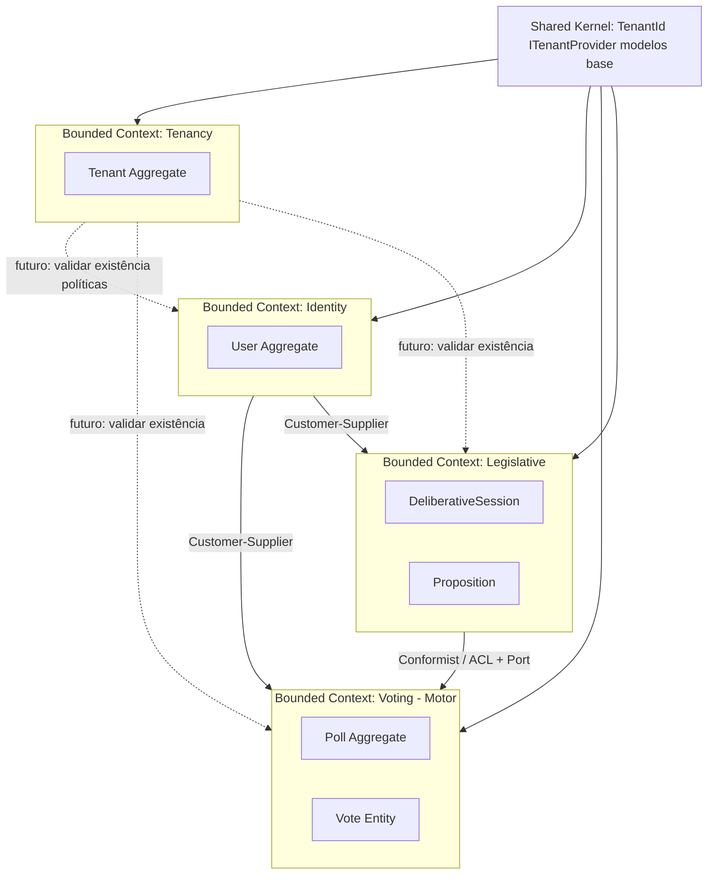
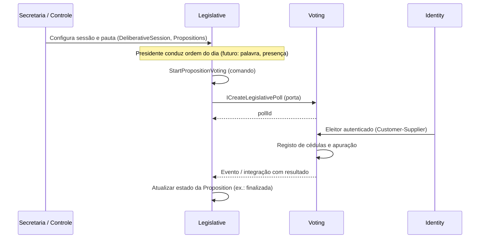

# DDD — Camada Estratégica

Este documento formaliza o design estratégico do sistema, garantindo o alinhamento entre o negócio e a implementação técnica de um motor de votação multi-tenant.

## 1. Visão Geral do Domínio

O sistema é um **Motor de Votação (Voting Engine)** agnóstico e de alta performance, desenhado para ser o alicerce de plataformas de governança digital. 

O diferencial core é a flexibilidade: o sistema não conhece as regras específicas de quem está votando (ex: Câmara Municipal vs. Condomínio), mas fornece as garantias fundamentais de **integridade, isolamento e auditabilidade** através de uma arquitetura **Multi-Tenant**.

### Objetivos Estratégicos
- **Isolamento de Dados**: Garantir que cada inquilino (Tenant) tenha sua própria jurisdição lógica.
- **Escalabilidade Horizontal**: Suportar o uso como SaaS (Software as a Service) ou instâncias isoladas (On-premise).
- **Agnosticismo**: Separar o "como votar" (Voting Context) de "o que está sendo decidido" (Legislative Context).

## 2. Mapa de Contextos (Context Map)

O sistema utiliza um **Shared Kernel** para primitivas comuns (`TenantId`, `ITenantProvider`, modelos base) e um **bounded context Tenancy** (`@repo/tenancy`) para o agregado **Tenant** (cadastro e ciclo de vida do inquilino). A resolução do inquilino na requisição HTTP continua na app (implementação de `ITenantProvider`); a persistência de metadados de tenant pode evoluir para Prisma sem misturar com Identity.

### Relação entre Contextos
- **Shared Kernel**: Provê `TenantId`, `ITenantProvider`, `AggregateRoot` e `UniqueEntityId`. Essencial para o isolamento e para a injeção do inquilino atual nos handlers.
- **Tenancy**: Agregado `Tenant`, portas `ITenantRepository`, query `GetTenantHandler`; repositório Prisma pode ser adicionado na app sem acoplar Legislative/Voting ao detalhe de persistência.
- **Identity -> Voting**: O contexto de Voting consome a identidade verificada do eleitor.
- **Legislative -> Voting**: O contexto legislativo orquestra a abertura de votação sobre **Proposições** via porta de aplicação (ex.: `ICreateLegislativePoll`); o motor mantém **Poll**, **Vote** e **Tally**. Sincronização de resultado (ex.: proposição finalizada) pode ocorrer por handler de integração.

## 3. Modelo de Tenancy e Isolamento

O sistema adota o modelo de **Isolamento Lógico (Shared Database)**.

- **Identidade Única**: Toda `AggregateRoot` nos contextos de negócio (Legislative, Voting, Identity por utilizador) possui um `TenantId` discriminador; o agregado **Tenant** no contexto Tenancy usa o mesmo valor como identidade (`Tenant.id === Tenant.tenantId`).
- **Filtro Obrigatório**: Repositórios e Handlers não podem realizar operações sem um `TenantId` válido.
- **Resolução de Contexto**: O inquilino da requisição é resolvido via `ITenantProvider` (Shared Kernel), tipicamente a partir do cabeçalho HTTP na app Nest.
- **Cadastro de inquilino**: Evolução natural — persistir `Tenant` (nome, estado) via `@repo/tenancy` e validar com `GetTenantHandler` nas bordas quando existir tabela ou cache de tenants.

## 4. Linguagem Ubíqua (Glossário)

| Termo (PT-BR) | Termo (Código) | Definição |
| :--- | :--- | :--- |
| **Inquilino** | `Tenant` | Uma organização isolada (ex: Câmara, Conselho, Associação); agregado no BC **Tenancy** (`@repo/tenancy`), com o mesmo identificador que `TenantId` no Shared Kernel. |
| **Sessão deliberativa** | `DeliberativeSession` | Evento que organiza a pauta de proposições e a condução na Câmara (presidente, ordem dos itens). |
| **Proposição** | `Proposition` | Objeto legislativo em tramitação; pode ser associado a uma `Poll` quando entra em votação. |
| **Pauta de votação (urna)** | `Poll` | No motor de votação: o que está aberto para receber cédulas (agnóstico ao tipo de projeto). |
| **Opção de Voto** | `PollOption` | Uma escolha válida (ex: Sim, Não). |
| **Parlamentar** | `Parliamentarian` | Usuário com poder deliberativo dentro de um Tenant. |
| **Cédula** | `Vote` | O registro imutável de uma intenção de voto. |
| **Apuração** | `Tally` | O resultado consolidado de uma sessão. |

**Presidente da sessão vs Presidente da Câmara:** no produto, **`PRESIDING_OFFICER`** refere-se ao **presidente da sessão deliberativa** em curso (vínculo típico: `DeliberativeSession.presidentId` → `Parliamentarian`). Na prática da Câmara, quem **preside** a sessão ordinária costuma ser o **Presidente da Câmara** ou um substituto regimental (Vice-Presidente ou outro vereador designado). O modelo de domínio **não** deve assumir que “Presidente da Câmara” (cargo na Mesa Diretora) é automaticamente o mesmo utilizador em **todas** as sessões ou em todos os atos do sistema — usar sempre o papel de sessão ou política por tenant para variância.

## 5. Classificação de Subdomínios

1.  **Core Domain (Voting Motor)**: O motor de regras, invariantes e apuração.
2.  **Supporting Subdomain (Identity)**: Gestão de acesso e perfis de utilizadores.
3.  **Generic Subdomain (Shared Kernel)**: Primitivas multi-tenant (`TenantId`, `ITenantProvider`) e tipos base DDD.
4.  **Supporting Subdomain (Tenancy)**: Cadastro e ciclo de vida do inquilino (`Tenant` em `@repo/tenancy`).
5.  **Supporting Subdomain (Legislative)**: Regras específicas de fluxos deliberativos (Câmaras, Assembleias).

## 6. Invariantes de Negócio (Regras de Ouro)

- **Isolamento Total**: Um inquilino nunca pode ler ou intervir em pautas de outro inquilino.
- **Unicidade de Voto**: Um eleitor só pode depositar uma cédula por pauta.
- **Imutabilidade**: Votos e resultados de apuração não podem ser alterados após o fechamento.
- **Integridade de Urna**: Votos só são aceitos em pautas com status `OPEN`.

---

## 7. Stakeholders e perfis (mapeamento para contextos)

Os perfis abaixo **não** são bounded contexts; indicam **quem** usa o sistema e **onde** vive a responsabilidade de negócio.

| Perfil | Responsabilidade principal | Contexto(s) |
| :--- | :--- | :--- |
| **Presidência da Câmara** | Conduzir sessão, controlar votação e uso da palavra | **Legislative** (ritmo, ordem do dia, palavra); comanda fluxos que disparam **Voting** |
| **Vereadores** | Presença, votar, acompanhar pauta, pedir palavra | **Legislative** + **Voting** (cédula) + **Identity** (quem é o parlamentar) |
| **Secretaria / Módulo Controle** | Configurar sessão, expedientes, operação | **Legislative** (configuração e operação do dia); alinhamento com **Voting** via casos de uso |
| **Administradores do sistema** | Utilizadores, cadastros, integrações | **Identity**; cadastros “da casa” em **Legislative**; wiring de integrações na **app (backend)** |
| **Equipe técnica (contratada)** | Implantação, suporte, manutenção, formação | **Fora do modelo de domínio** (plataforma e operações) |
| **População** | Painel público em tempo real, resultados | **Leitura**: projeções sobre **Voting** e **Legislative**; canais em tempo real na **infraestrutura / backend** |

O **Módulo Controle** é, em geral, uma **superfície da aplicação** (papéis e telas), não um pacote de domínio com esse nome.

## 8. Fluxo MVP — sessão deliberativa → votação → resultado

Fluxo feliz alinhado ao desenho atual do pacote **legislative** e à integração com o motor **voting**:

**Backlog de produto sugerido** (para detalhar requisitos por iteração):

1. **Legislative**: criar/editar sessão deliberativa e proposições na pauta; comando de abertura de votação já modelado (`StartPropositionVoting`).
2. **Voting**: manter invariantes de urna; expor leitura para painel conforme política de transparência.
3. **Integração**: sincronizar resultado da `Poll` com o estado da `Proposition` (padrão já referenciado por handlers de evento).
4. **Painel público**: tempo real e nominal/agregado — decisão de produto + implementação na app (não no núcleo DDD).

## 9. Decisões de fronteira (Legislative ↔ Voting)

| Decisão | Recomendação |
| :--- | :--- |
| Dono de “sessão aberta”, “item em votação” | **Legislative** (`DeliberativeSession`, `Proposition`). |
| Dono de regras de urna e apuração | **Voting** (`Poll`, `Vote`, `Tally`). |
| O que o Voting recebe da Legislative | Identificadores e opções mínimas via **porta**; evitar acoplar o motor a metadados legislativos pesados. |
| Sincronização de resultado | **Integração**: eventos ou handlers de aplicação (ex.: proposição finalizada após fecho da poll), implementação concreta na composição (backend). |
| Uso da palavra, presença, quórum | **Legislative** (subáreas da sessão); não misturar com agregados do motor. |

---

## 10. Checklist de Conformidade DDD

Para garantir a saúde do projeto, seguimos rigorosamente este checklist:

### Camada Estratégica
- [x] **Linguagem Ubíqua**: Formalizada na seção 4 deste documento.
- [x] **Bounded Contexts**: Delimitados em pacotes NPM separados.
- [x] **Context Map**: Visualizado na seção 2.
- [x] **Subdomínios**: Identificados na seção 5.
- [x] **Stakeholders e fluxo MVP**: Secções 7 e 8.

### Camada Tática
- [x] **Entidades**: Identidade (`UniqueEntityId`) e comportamento encapsulado.
- [x] **Value Objects**: Imutáveis e sem identidade (ex: `Email`, `PasswordHash`).
- [x] **Agregados**: Raízes que garantem consistência transacional.
- [x] **Repositórios**: Abstraem persistência, nunca vazam detalhes de DB.
- [x] **Eventos de Domínio**: Comunicam mudanças (`UserRegisteredEvent`, etc.).

### Arquitetura
- [x] **Independência**: O domínio é ignorante quanto a frameworks e bancos de dados.
- [x] **Multi-Tenancy**: Isolamento garantido por `TenantId` no `AggregateRoot`.
