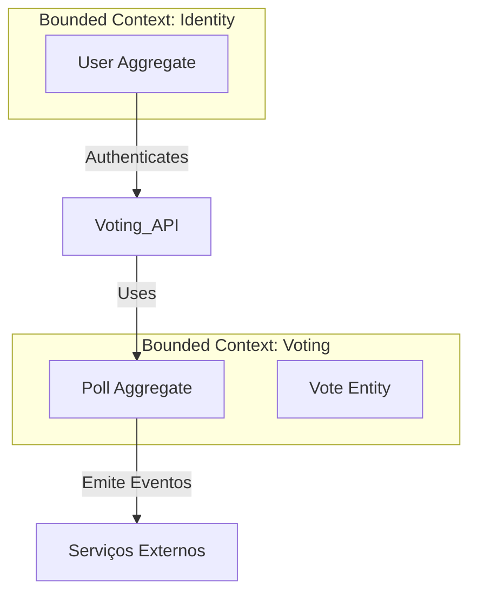

# DDD — Camada Estratégica

Este documento formaliza o design estratégico do sistema, garantindo o alinhamento entre o negócio e a implementação técnica.

## 1. Mapa de Contextos (Context Map)

O sistema é composto por dois Bounded Contexts principais.

### Relação entre Contextos
- **Identity -> Voting**: Relação de *Customer-Supplier*. O contexto de Voting depende do `VoterId` (provido pelo Identity) para garantir a unicidade do voto.

---

## 2. Linguagem Ubíqua (Glossário)

| Termo (PT-BR) | Termo (Código) | Definição |
| :--- | :--- | :--- |
| **Pauta / Sessão** | `Poll` | O objeto central que define o que está sendo votado. |
| **Opção de Voto** | `PollOption` | Uma escolha válida (ex: Sim, Não, Abstenção). |
| **Eleitor** | `Voter` | Autorizado a registrar um voto. |
| **Cédula / Voto** | `Vote` | O registro individual de um voto. |
| **Apuração** | `Tally` | O resultado final consolidado. |

---

## 3. Classificação de Subdomínios

1.  **Core Domain (Votação)**: Diferencial competitivo.
2.  **Supporting Subdomain (Identity)**: Essencial para o funcionamento, mas não o núcleo.
3.  **Generic Subdomain (Shared Kernel)**: Utilitários técnicos reutilizáveis.

---

## 4. Invariantes de Negócio (Regras de Ouro)

- **Unicidade**: Um eleitor só pode depositar uma cédula por pauta.
- **Imutabilidade**: Voto não pode ser alterado após registro.
- **Integridade**: Votos só permitidos em urnas `OPEN`.
- **Consistência**: Total da apuração deve coincidir com os votos.
